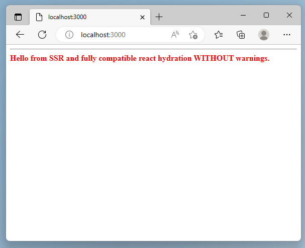

## WebComponent with React/NextJS SSR and Hydration

> Updated to work without a custom server.js and to use the new `shadowrootmode` attribute.

This is a proof of concept on how SSR and WebComponents can work together.
The WebComponent uses `Declarative Shadow DOM (DSD)`.

`ssr-compatible-comp` is a WebComponent where the DSD is added after NextJS rendered its html. This allows to declare the WebComponent without any manual DSD.



Firefox support is added via a [Polyfill](https://web.dev/declarative-shadow-dom/#polyfill).

## Technical problem

Before DSD, providing SSR with WebComponents was and still is a pain. WebComponent frameworks implement their custom SSR solutions and when they are integrated with other frameworks like React, NextJS, Angular or VueJS, problems start to appear.

The biggest problem is that the code most WebComponent frameworks generate is not isomoprhic between server and client. Most of the time layout is changed (handling the shadowroot content), classes are removed and even the whole CSS is scoped and rewritten (looking at you, StencilJS Hydrate).

One solution to this is shown in this repo with DSD. The WebComponent can be used like regular client-side WebComponents, as seen in the `pages/index.tsx`:

```js
<ssr-compatible-comp>
  Hello from SSR and fully compatible react hydration WITHOUT warnings.
</ssr-compatible-comp>
```

With using DSD as our SSR result, we dont need to handle any custom re-hydration logic, but can use a cross-compatible way of SSR with hydration of WebComponents.

In the `server.mjs`, we inject DSD into our `ssr-compatible-comp`, which results in the following server-side generated html.

```html
<ssr-compatible-comp>
  <template shadowroot="open">
    <style>
      strong { color: red; }
    </style>
    <strong>
      <slot></slot>
    </strong>
  </template>
  Hello from SSR and fully compatible react hydration WITHOUT warnings.
</ssr-compatible-comp>
```

As soon as the browser parses the template shadowroot tag, it is replaced with a #shadow-root fragment and its content placed there automatically. 
If react now starts with its hydration phase, the element tree is back to its fully compatible form, as the one we declared in the `pages/index.tsx`.

DOM after parsing and before react hydration:

```html
<ssr-compatible-comp>
  #shadow-root (open)
    ...
  Hello from SSR and fully compatible react hydration WITHOUT warnings.
</ssr-compatible-comp>
```

For more information on DSD, see: [Declarative Shadow DOM](https://github.com/mfreed7/declarative-shadow-dom).

## Getting Started

1. First, install packages:

`npm install`


2. Run the development server:

```bash
npm run dev
# or
yarn dev
# or
pnpm dev
```

Open [http://localhost:3000](http://localhost:3000) with your browser to see the result.

